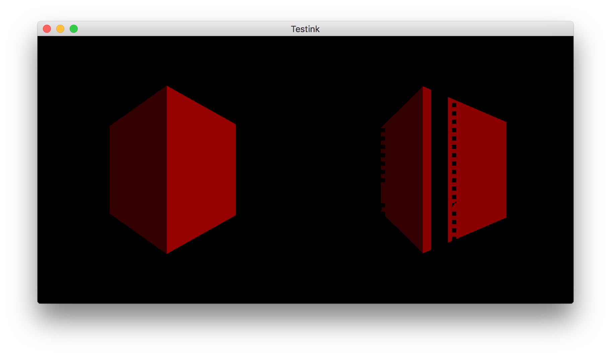
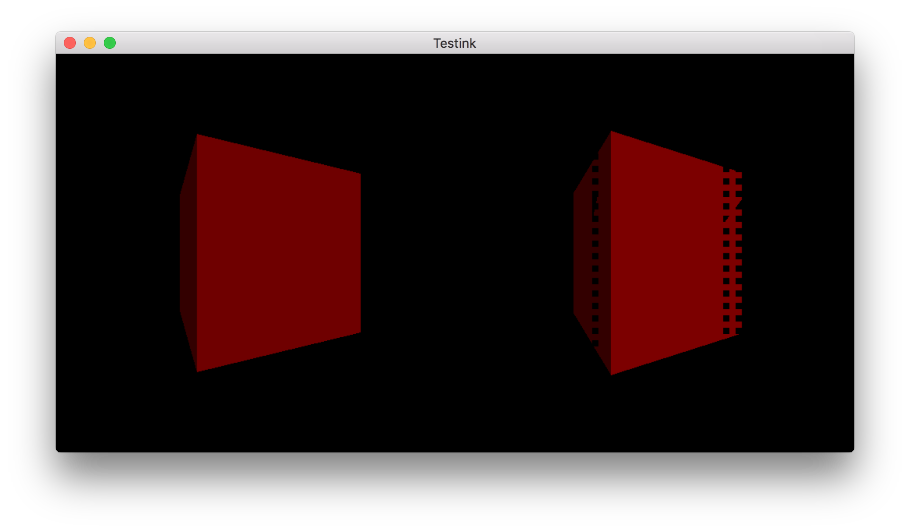

# Texture Array Render Target Bug

Demonstrates a bug in the NVIDIA driver for MacOS regarding rendering to a texture array target.
Observed on a 2014 MacBook Pro, running 10.12.6 with a NVIDIA GeForce GT 750M 2048 MB.
GL Version string: 4.1 NVIDIA-10.17.5 355.10.05.45f01

## Running

```
git clone https://github.com/pmuetschard/array-tex-bug
git submodule update --init
mkdir build
cd build
cmake ..
make
./array-tex-bug
```

Press the space bar to toggle between these 3 modes:

 1. Draw right (2nd) cube slightly less rotated - artifacts appear on left side of the cube.
 2. Draw right cube slightly more rotated - artifacts appear on the right side of the cube.
 3. Draw both cube at same rotation - no articacts.

Press ESC to quit the application.

## Background

It appears that if a texture array's layer is used as the depth attachment of a framebuffer, draw
calls leak depth values to other layers in the texture array. The pseudo code of this repro case is:

```
create two texture arrays, one for color and one for depth, each with two layers
create a framebuffer

bind layer 0 of the arrays to the framebuffer's color and depth attachments
clear the framebuffer
bind layer 1 of the arrays to the framebuffer's color and depth attachments
clear the framebuffer
// At this point, both set of layers should be cleared

bind layer 0 of the arrays to the framebuffer's color and depth attachments
render a scene
bind layer 1 of the arrays to the framebuffer's color and depth attachments
render a slightly different scene
// Observe the rendering artifacts in the second scene, due to framgents failing the depth test
```

## Screenshots



